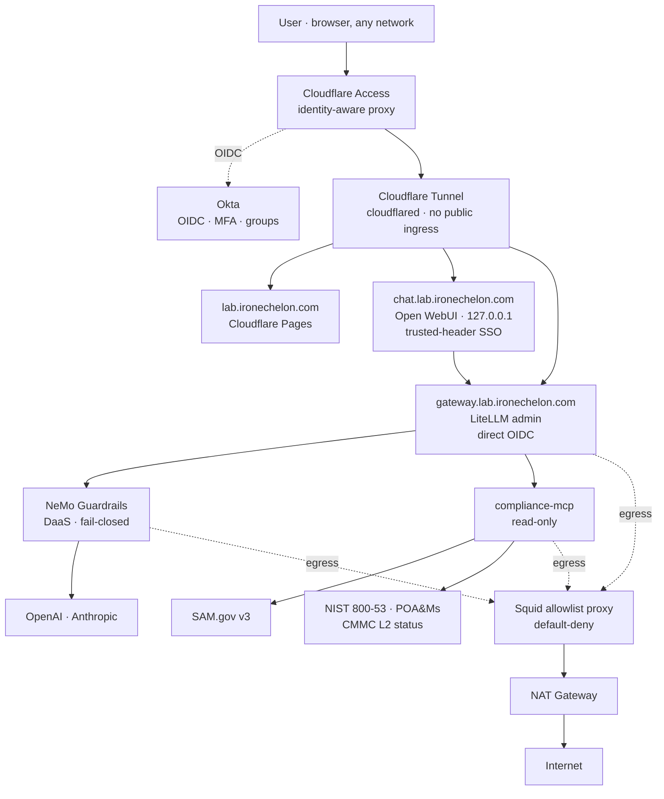

# Zero Trust AI Lab

A reference design for SBIR/CMMC-bound teams who need defensible AI tooling
without enterprise Zero Trust vendor pricing. Cloudflare Zero Trust + AWS + Okta
Developer + open-source components, assembled as a credible counterpart to a
Zscaler-based reference architecture.

Built by **Optimal, LLC (CAGE 14HQ0)** as a reference design for SBIR/STTR
awardees and small DIB shops pursuing **CMMC Level 2 self-assessment readiness**.

> **This is a reference design, not a product, and not a CMMC assessment boundary.**
> It holds no client data and is not itself a compliance attestation. See
> [Disclaimers](#disclaimers--what-this-is-not).

---

## Contents

- [Who this is for](#who-this-is-for)
- [Architecture](#architecture)
- [The stack — commercial reference vs. this lab](#the-stack--commercial-reference-vs-this-lab)
- [SSO model — two patterns, two blast radii](#sso-model--two-patterns-two-blast-radii)
- [Prerequisites](#prerequisites)
- [Deploy order](#deploy-order)
- [Cost](#cost)
- [Security notes](#security-notes)
- [What's worth defending in this design](#whats-worth-defending-in-this-design)
- [Disclaimers — what this is not](#disclaimers--what-this-is-not)
- [What to build next](#what-to-build-next)
- [Build status](#build-status)
- [Start here](#start-here)

---

## Who this is for

- **SBIR / STTR awardees** standing up an LLM gateway for the first time and who
  need a defensible Zero Trust posture they can explain to a contracting officer
  or a 3PAO.
- **Small DIB shops** pursuing **CMMC Level 2** self-assessment readiness who
  cannot reach for ZPA + ZIA + AI Guard at enterprise prices.
- **Compliance and security engineers** who want a working example of how MCP,
  guardrails, and identity-aware access fit together.

It is **not** intended to replace enterprise Zero Trust for organizations that
already have it, and it is **not** a compliance attestation.

## Architecture



**DNS:** the lab hostnames live in **Cloudflare DNS under `ironechelon.com`**.
Cloudflare Access requires the application domain to be on a Cloudflare-managed
zone (subdomain zones on Free aren't permitted), so the original `lab.gooptimal.io`
plan ([ADR-008](docs/decisions.md)) was pivoted to `lab.ironechelon.com`
([ADR-010](docs/decisions.md)). `gooptimal.io` is **untouched** — apex, MX, SPF,
DKIM, DMARC, `outpost`, `ai-security`, etc. all in their original Google DNS
state, which was the protection ADR-008 wanted.

**No public ingress to any EC2 instance.** Reachability is exclusively through
Cloudflare Tunnel; the EC2 security groups open zero inbound ports to the
internet.

## The stack — commercial reference vs. this lab

| Capability | Commercial (Zscaler-style) | This lab |
|---|---|---|
| Private app access | ZPA | **Cloudflare Access + Tunnel**, OIDC → Okta |
| Workload egress control | ZIA / Secure Web Gateway | **Squid allowlist proxy** (AWS Network Firewall optional) |
| AI guard / prompt firewall | AI Guard | **NeMo Guardrails**, DaaS, fail-closed |
| Data-loss / secret detection | Inline DLP / CASB | NeMo secret + PII (Luhn) detectors + Cloudflare Gateway DLP |
| Identity, MFA, groups | IdP integration | **Okta** (OIDC, groups claim, MFA) |
| Device trust / posture | Client connector posture | **Cloudflare WARP** device posture |
| Centralized logging | SIEM connector | CloudWatch + LiteLLM Postgres + Splunk HEC (stub) |

## SSO model — two patterns, two blast radii

The lab uses **two independent auth surfaces** because the two apps have very
different blast radii ([ADR-007](docs/decisions.md)):

- **Open WebUI** (chat) → **trusted-header SSO.** Cloudflare Access does the
  full Okta OIDC handshake at the edge, then injects
  `Cf-Access-Authenticated-User-Email` / `-Name` on the request to origin. Open
  WebUI runs with `WEBUI_AUTH=true` and `WEBUI_AUTH_TRUSTED_EMAIL_HEADER=...`.
  **Load-bearing invariant:** the container binds to `127.0.0.1:8080` only —
  anything that can reach the port bypassing `cloudflared` could forge the
  header. The localhost bind *is* the security boundary for this app.

- **LiteLLM admin panel** → **direct OIDC to Okta.** LiteLLM registers as its
  own Okta app, performs its own handshake, and reads the `groups` claim
  (`lab-admins → proxy_admin`, everyone else → viewer). Cloudflare Access still
  gates network reachability (defense in depth), but the app does not trust an
  injected header for privileged actions.

A single user's prompt produces **four correlated audit records** — Okta →
Cloudflare Access → Open WebUI → LiteLLM + MCP — tied together by their email
and the `litellm_call_id` (see [`docs/sso-role-mapping.md`](docs/sso-role-mapping.md)).

## Prerequisites

| Tool | Why |
|---|---|
| Terraform ≥ 1.6 (`brew install hashicorp/tap/terraform`) | Infra |
| AWS provider 5.x (auto via `terraform init`) | Pinned `~> 5.92`, installed v5.100.0 |
| AWS CLI v2 + credentials for the lab account | `apply` + `aws ssm start-session` + secret seeding |
| Docker + Compose v2 | Container stacks |
| Python ≥ 3.11 | MCP server + NeMo guardrail tests |
| `gh` (GitHub CLI) | Optional — repo + Pages workflows |
| `wrangler` (Cloudflare CLI) | Optional — Pages from the terminal |
| `dig` | DNS verification |

External accounts you will need: **AWS** (this lab uses account `317839577064`),
**Cloudflare** (free tier, with an active zone — `ironechelon.com` in this build),
**Okta Developer** (free Workforce Identity tenant), and **GitHub** (for source +
Pages). **OpenAI / Anthropic** keys for the providers and a **SAM.gov** API key
for the compliance MCP.

## Deploy order

Follow the phase order: **0 → 1 → 1.5 → 2 → 3 → 4 → 4.5 → 5**.

1. **Phase 0 — scaffolding & ADRs.** Already in the repo. Start by reading
   [`docs/decisions.md`](docs/decisions.md) and
   [`docs/threat-model.md`](docs/threat-model.md).
2. **Phase 1 — Terraform AWS baseline.**
   ```bash
   cd terraform
   terraform init
   terraform plan -out=tfplan
   terraform apply tfplan
   ./../scripts/seed-secrets.sh                # non-Okta lab/* secrets
   ```
3. **Phase 1.5 — identity plane.** Follow [`docs/okta-setup.md`](docs/okta-setup.md)
   then [`docs/cloudflare-access-policies.md`](docs/cloudflare-access-policies.md).
   `./scripts/seed-okta-secrets.sh` for the five Okta values; `./scripts/test-sso.sh`
   for the structural pre-flight.
4. **Phase 2 — container stacks.** SSH-less: enroll the SSM agent, then enable
   the systemd units on each host:
   ```bash
   sudo systemctl enable --now ai-lab-stack@gateway   # on the gateway host
   sudo systemctl enable --now ai-lab-stack@chat      # on the chat host
   ```
5. **Phase 3 — compliance MCP.** Built into the gateway stack. Tests:
   ```bash
   cd mcp-server && python -m venv .venv && . .venv/bin/activate
   pip install -r requirements-dev.txt
   python -m pytest --cov=src -q                # 47 pass, 88% cov
   ```
6. **Phase 4 — Cloudflare DNS.** Follow
   [`docs/google-dns-cnames.md`](docs/google-dns-cnames.md) — **do not touch
   anything outside `lab.`**.
7. **Phase 4.5 — landing page.** Cloudflare Pages connected to this repo;
   output dir `landing/` — see [`landing/README.md`](landing/README.md).
8. **Phase 5 — testing.** [`docs/test-plan.md`](docs/test-plan.md) +
   `./scripts/run-smoke-tests.sh` from an SSM shell.

## Cost

Target: **~$75–85/month at idle**, single-AZ, t3.small, gp3. The big cost fork
was egress filtering — AWS Network Firewall (~$288/mo for one endpoint) blew
through the budget, so the default is a hardened **Squid allowlist proxy** behind
NAT (~$41/mo of infra). NFW is retained as an optional `egress_mode =
"networkfirewall"` module ([ADR-009](docs/decisions.md)).

| Line item | ~$/mo |
|---|---|
| NAT Gateway (hourly + minimal data) | ~33 |
| 2× t3.small app hosts | ~30 |
| t3.micro Squid proxy | ~8 |
| gp3 EBS (3 vols) + CloudWatch + Secrets Manager | ~5–10 |
| **Total (`egress_mode = proxy`, default)** | **~75–85** |
| *Alt: `egress_mode = networkfirewall`* | *+~255* |

Cloudflare Pages + Cloudflare Zero Trust (single seat) + Okta Developer are all
**$0** on free tiers.

## Security notes

- **No public ingress to any EC2 instance.** Security groups open zero inbound
  ports to the internet; reachability is exclusively through Cloudflare Tunnel.
- **No SSH on any instance.** All operator shell access goes through **AWS SSM
  Session Manager** ([ADR-006](docs/decisions.md)). No key material to rotate.
- **IMDSv2 required** on all three instances.
- **Default-deny egress.** App hosts have no direct route to 80/443 — the
  security group blocks it, so HTTP/HTTPS *can only* leave through the Squid
  allowlist. cloudflared's port 7844 is the one exception, scoped to the
  Cloudflare edge.
- **Scoped IAM.** The instance role is restricted to `secretsmanager:GetSecretValue`
  on `arn:aws:secretsmanager:us-east-1:317839577064:secret:lab/*` and CloudWatch
  Logs write on the lab log groups — no wildcards on account or service.
- **Secrets in tmpfs only.** `secrets-bootstrap.sh` pulls `lab/*` from AWS
  Secrets Manager into `/run/ai-lab/<role>.env` (mode 0600, RAM-backed) and
  symlinks it as the compose `.env`. Nothing ever lands on disk or in Git.
- **Guardrails fail closed.** If the NeMo DaaS service is unreachable, the
  LiteLLM custom guardrail blocks the request rather than allowing it through.
- **MCP is read-only.** The SQLite store opens `mode=ro`; status filters are
  enum-validated; arguments are Pydantic-typed. Write-mode is a separate,
  gated project ([`docs/mcp-write-mode.md`](docs/mcp-write-mode.md)).
- **Local Terraform state.** Acceptable while this lab holds no real data —
  ([ADR-001](docs/decisions.md)); the first thing to revisit if that ever changes.

## What's worth defending in this design

- **Two-pattern SSO split** — trusted-header for chat, direct OIDC for admin.
  Match the auth mechanism to the blast radius.
- **Default-deny egress is structural, not advisory.** The SG enforces it; the
  proxy is the allowlist; nothing can opt out by ignoring an env var.
- **Read-only MCP first.** Bounds the blast radius of prompt injection from
  data-integrity incident to "read seeded lab data."
- **DaaS guardrails with deterministic detectors.** The security-critical
  detection is pure-Python, unit-tested (23/23 here) and called as NeMo custom
  actions — NeMo orchestrates, detectors decide.
- **Compliance teams should run MCP against their own evidence.** SAM.gov,
  NIST 800-53, POA&Ms, CMMC L2 — inside a gateway they control.
- **3PAO mindset, IaC defaults.** Every material decision is an ADR with
  context, alternatives, and consequences; every infra change is a TF diff.

## Disclaimers — what this is not

- **Not a CMMC assessment boundary.** The CMMC L2 dashboard is illustrative seed
  data, not an attestation.
- **Not a compliance certification of any kind** (CMMC, FedRAMP, 800-53, 800-171).
- **No client data.** Lab runs on personal AWS, personal Cloudflare, personal
  Okta, personal domain. It does not touch any client engagement, any FedRAMP
  boundary, or any DDC/Motorola/Ignyte work product.
- **Not a Zscaler replacement** for enterprises that already have ZPA + ZIA.
- **Not multi-tenant or production-hardened.** Single operator, single AZ,
  local Terraform state — fine for the lab, not for a real workload.

## What to build next

- **`docs/phase2.md` — Cloudflare Gateway via WARP Connector.** Move egress
  policy to the same identity-aware control plane as ingress.
- **MCP write mode** — per the prerequisites in
  [`docs/mcp-write-mode.md`](docs/mcp-write-mode.md). A separate security
  project, not a feature flag.
- **`rag.lab.ironechelon.com`** — a second app under the same `lab.` namespace
  exercising retrieval-augmented generation against the same MCP evidence
  store. The DNS pattern already supports it.
- **Remote Terraform state** (S3 + DynamoDB) if the lab ever holds anything
  resembling real data — supersede [ADR-001](docs/decisions.md) first.
- **A real device posture catalog** instead of just "WARP healthy."

## Build status

| Phase | Scope | State |
|---|---|---|
| 0 | Scaffolding, ADRs, threat model, `.gitignore` | ✅ done |
| 1 | Terraform AWS baseline (VPC, Squid egress, EC2, secrets, logging) | ✅ fmt + validate clean |
| 1.5 | Identity plane — Okta + Cloudflare Access SSO | ✅ runbooks + TF + scripts |
| 2 | Docker Compose stacks (Open WebUI, LiteLLM, NeMo, MCP) | ✅ stacks validate; detectors 23/23 |
| 3 | Compliance MCP server (the differentiator) | ✅ 47 tests, 88% cov |
| 4 | Cloudflare config (tunnels, Access apps, Gateway, DNS) | ✅ runbooks + DNS |
| 4.5 | Landing page at `lab.ironechelon.com` | ✅ static, ~10kb |
| 5 | Test plan + smoke-test script | ✅ documented |
| 6 | Full README + LinkedIn talking points | ✅ this file |

## Start here

- **The "why":** [`docs/decisions.md`](docs/decisions.md) — ADR-001..009.
- **The threat model:** [`docs/threat-model.md`](docs/threat-model.md) — STRIDE
  per component + AI-specific.
- **Run the smoke tests:** [`docs/test-plan.md`](docs/test-plan.md).
- **LinkedIn:** [`docs/linkedin-talking-points.md`](docs/linkedin-talking-points.md).
- **The original build spec:** [`prompts/CLAUDE_CODE_PROMPT.md`](prompts/CLAUDE_CODE_PROMPT.md).

---

*Reference design © Optimal, LLC (CAGE 14HQ0). Built by Ryan on personal time
and personal infrastructure. Source: [github.com/optimal-cyber/AI-Lab](https://github.com/optimal-cyber/AI-Lab).*
